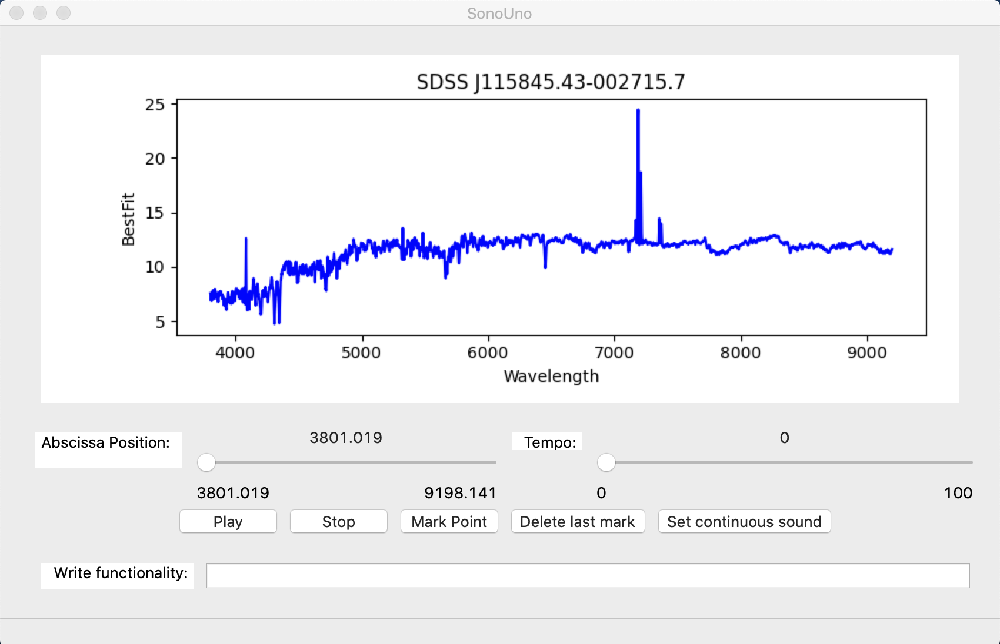

# SonoUno Software

This development is powered by CONICET-Argentina, Universidad de Mendoza-Argentina and REINFORCE.

   

## Description



SonoUno is a sonification software for astronomical data presented on a table (txt or csv files). The software is being developed based on the study of other software (Sonification Sandbox, MathTrax and xSonify) and standards of accessibility like the ISO 9241-171:2008 (Guidance on software accessibility). In order to develop the first approach of a graphical user interface, we perform a theoretical framework based on bibliography of user cases, focused on blind and visual impairment people.

The develop language is Python and we use modular design, in order to do collaborative work. The sonoUno now is multiplatform, tested on windows 10, Ubuntu (16.04 and 18.04), CentOS 7 and Mac (Mojave and Catalina); the development team work continuously to maintain this benefit. The principal goal of the SonoUno is to allow the user to open data files (txt or csv extension), show the plot and sonify the data. At the moment, the sonification is perform by variation of pitch and the sonification settings allow to change the volume and the timbre.

Additionally, SonoUno allow to select a specific range of data on the ‘x’ axis, mark and save point of interest in the data, apply predefined mathematical functions (for example, logarithm and square) and manipulate the data arrays with an Octave interface. In the section settings, the user can configure the plot and some features of the sound.

Finally, the software allows the user to save the plot, a text file with the points marked on the data and a csv file with the plotted data.

## News about compatibility problems!

We want to let you know that sonoUno is facing problems with Python 3.10 and wxPython this days, there is an issue opened about it. I will erase this news when the probleme was fixed! SonoUno works fine with previous version of python (python 3.8 and early python 3.9).

## Installation

Here we show a quick guide to install the sonoUno. Inside the sonoUno folder, there are some installation instructive, one for each operative system.

1.	Install octave

For Mac you can use brew: ```brew install octave```\
For Ubuntu: ```sudo apt install octave```\
For Centos: ```yum install epel-release```\ ```yum install octave```\
For Windows download the installer from: https://ftpmirror.gnu.org/octave/windows/octave-5.2.0_1-w64-installer.exe . Once is installed you have to set the environment variables.

2.	Check that you have python 3.x installed on your system running ‘python3’ or ‘python’ on a terminal. If you don’t have python:

For Mac: ```brew install python3```\
For Ubuntu: ```sudo apt install --upgrade python3```\
For Centos7: \
  To install python3 without interfear with python2:```sudo yum install centos-release-scl```\ ```sudo yum install rh-python36```\
  To enable python3: ```scl enable rh-python36 bash```\
For Windows download the installer from: https://www.python.org/ftp/python/3.8.1/python-3.8.1-amd64.exe\

Note: from here we use python3, you have to use python or python3 depending on the step before.

3.	Check that pip is installed with ‘python3 -m pip -V’. If not:

For Mac, pip is installed with python installation.\
For Ubuntu: ```sudo apt install python3-pip```\
For Centos, pip is installed with python installation.\
For Windows, pip is installed with the executable.

4.  Only for Linux you have to install some other packages:\
Ubuntu: ```sudo apt install libsdl2-mixer-2.0-0 libsdl2-image-2.0-0 libsdl2-2.0-0 libsdl-ttf2.0-0 libgtk-3-dev```\
  For ubuntu-16.04:\
```python3 -m pip install -U -f https://extras.wxpython.org/wxPython4/extras/linux/gtk3/ubuntu-16.04 wxPython```\
  For ubuntu-18.04:\
```python3 -m pip install -U -f https://extras.wxpython.org/wxPython4/extras/linux/gtk3/ubuntu-18.04 wxPython```\
  For ubuntu-20.04:\
```python3 -m pip install -U -f https://extras.wxpython.org/wxPython4/extras/linux/gtk3/ubuntu-20.04 wxPython```\
  For ubuntu-22.04:\
```python3 -m pip install -U -f https://extras.wxpython.org/wxPython4/extras/linux/gtk3/ubuntu-22.04 wxPython```\
Centos: ```yum install SDL```\
```pip install -U -f https://extras.wxpython.org/wxPython4/extras/linux/gtk3/centos-7 wxPython```

5.	If you want to download the software from the repository install git, if not you can use the version on Pypi.

## Opening the software with Graphic User Interface

### From Pypi (only Linux and Mac)

Install with pip:\
```python3 -m pip install sonoUno```

To open the sonoUno software:\
```sonouno```

### From github

Download from the webpage: https://github.com/sonoUnoTeam/sonoUno . Go to Downloads and unzip the file.


The other option is to clone the git repository from the terminal with:\
```git clone https://github.com/sonoUnoTeam/sonoUno.git```

Then, on the terminal, go to the folder which contain the setup.py and install it:\
```python3 -m pip install .```

To open the sonoUno software:\
```cd sonoUno```\
```python3 sonoUno```

## Using sonify_bash.py to sonify data files in bash mode

To run this script:
```cd sonoUno```\
```python3 sonify_bash.py -t "files_extension" -d "path_to_directory"```

### Description

The script sonify the first two columns of csv or txt files. The script search inside the folder provided by the user all the data files with the given extension (if not, txt extension is setted as default) and sonify it; then, store the wav files with the same data file name adding '_sound' at the end.
  The script additionally allow to save the plot with '-p True', as default is setted on False.

### Parameters to set

To use the script the directory where the data files are located has to be send when you run the script with the '-d' indication.
In addition, if you will sonify data files with csv extension, you must indicate it with the '-t'. 
To additionally save the plot of each data set, indicate it with '-p True'
If you need help to run the script you can write:
```python3 sonify_bash.py -h```

### Default parameters

About the data files:
    If not extension is given, by default search txt files.
    About the plot, as default the script don't save it.
    At the moment search all files with the given extension inside the folder, we hope to add the posibility to use a text file with names, or the data file name to sonify only this file.
    
About the sound the presets are:
    *SonoUno continuous sound
    *Celesta as the waveform
    *A time base of 0.05
    We continue working to allow to change this preset from the command line.
    
