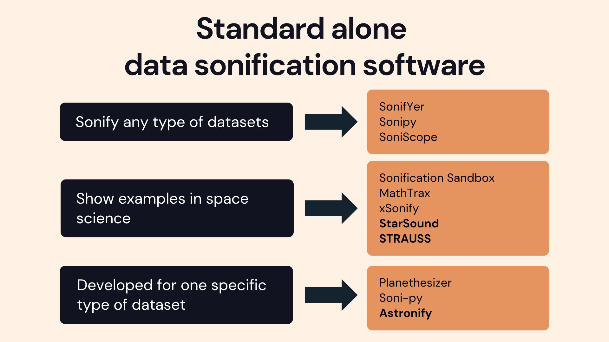

# Summary

The sonification field has grown continuously over the recent years, especially since 1992 with the International Community for Auditory Display-ICAD conferences. Sonification is by definition the use of non-speech audio to translate data into sound, in this case, a sonification software, sonoUno, and its application in astronomy are presented, without neglecting the analysis possibilities for data from various disciplines. The differences between the present development from others are: it is user centred from the beginning, with several contacts with end users along the design and a focus group test; it seeks a way to bring autonomy to its functional diverse users; and it presents a simple first framework, with the mathematical operations and settings in the menu. A description of the software, the impact on the design after end users' contacts, its functionalities, and some specific applications using different sets of astrophysical datasets are presented.

In general, people think about information and nature based on a visual approach, but what if we go back to our childhood and try to understand the world through our different senses? In this contribution a new way to face astrophysical data is presented, emphasizing the possibility of multisensorial scientific work.

# Introduction

The human being by nature explores the world through all his senses, however, there is a marked predominance in the use of visual displays to make sense of data sets under study. This is the case in astronomy,  even with evidence of the benefits of the auditory display as a complement to visual display [@wandatesis2013].

The use of sonification in astronomy has existed for years, some recent examples are a sonification of the zCOSMOS astronomical dataset, where the authors describe the dataset and the sonification strategy used [@bardellietal2021]; the LightSound, an electronic device that allows the conversion of light into sound and it is used to observe eclipses [@lightsound2020]; See-Through-Sound, a project dedicated to converting images into sound to allow visually impaired people to detect objects around them [@henriquesetal2014]; R-Scuti, an audio-visual installation that proposes the conversion of astronomical data from the AAVSO (American Association of Variable Star Observers) database into an exhibition environment, using recordings of variable star observations [@laurentizetal2021]; and an accessible science lab, research that highlights the need for multimodal approaches in teaching and learning environments, presenting principles for inclusive material design based on user-centred design and universal design for teaching environments [@reynagaetal2020].

Nevertheless, in most cases, the sonification mapping of the dataset was defined by its creator and shared as a final product, not clearly devoted to research. The ICAD conference intended to bring together multidisciplinary experts working in this field of sonification, since its creation in 1992, in its repository there are a lot of works that [@andreopoulouYgoudarzi2021] grouped into six categories (sonification methods, sonification tools/system, review/opinion, exploratory, perception/evaluation studies and other). This systematic review of the ICAD repository highlights a high percentage of papers devoted to sonification methods and tools, in contrast to a low percentage of papers devoted to design methodologies, perception studies, and evaluation methods. It is alarming that the perception studies present a growth between 2005-2009, but decreased by under 1% to 2019; even when [@fergusonYbrewster2017] point out the importance of perception studies in auditory displays and report some psychoacoustic parameters and talk about how people perceive it. 

In this sense and taking into account the increasing examples of sonification in astrophysics, sonoUno aims to provide an open-source platform that allows users to open different datasets, and explore them through visual and auditory display, the last permitting to adjust visual and sound settings to enhance their perception. This project is user centred from the beginning, to reach that goal at first the ISO 9241-171:2008 standard was used to analyse the accessibility of three previous software [@ise2a2017;ijskd2022] and construct the first Graphic User Interface (GUI) mock-up; second, a theoretical framework centred on visual disability was designed and applied to the software in development [@casadoetal2019], the consequent ISO analysis to sonoUno show very good results. Finally, a focus group session was conducted with people with and without visual disabilities to test the first version of sonoUno, some recommendations and updates arise from that study [@casadoFG2022]. In this contribution, the final version and architecture of sonoUno were explained and the new functionalities are tested with astronomical data sets.

# Previous works

The number of projects using sonification to represent astrophysical data has grown enormously over the last 10 years. @zanella2022, after an international sound workshop held in August 2021, created a repository with existing software until December 2021, which yields a result of 98 projects developed since 1962, many of them discontinued, with lack of documentation or without evidence of applications in science. Almost 80% of the sonification projects have been carried out between 2011 and 2021. Until 2017, the date on which this sonification software development began, only 50% of the software included in the mentioned repository had started its development.

{width=100%}

# Statement of need

# Mathematics

# Citations

# Figures

# Acknowledgements

# References
